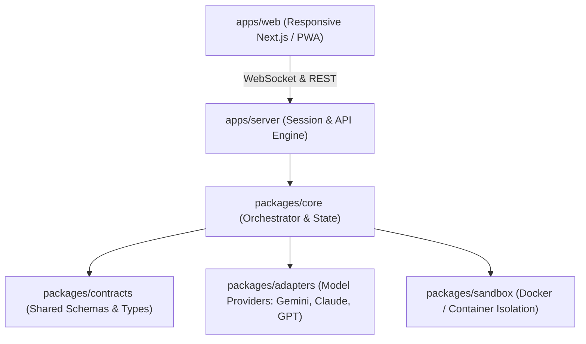

# Maintainer Architecture & Contract Boundary

> **Audience Notice:** This document defines internal system layers, contract boundaries, and execution protocols for **tony-harness**. Do not reference these internal paths in end-user facing documentation.

---

## 1. System Topology

`tony-harness` is organized as a modular TypeScript monorepo with clean architectural boundaries:

---

## 2. Layer Boundaries & Responsibilities

### A. Contracts Layer (`packages/contracts`)
- The single source of truth for data models, event schemas, and API interfaces.
- Contains typed validation schemas (using Zod) for:
  - Model requests, streaming chunks, and tool definitions.
  - Workspace state, session events, and user actions.
  - Sandbox command execution inputs and outputs.
- **Constraint:** Zero external dependencies on framework-specific code (no React, Express, or Docker imports).

### B. Core Domain (`packages/core`)
- Orchestrates multi-model execution:
  - **Parallel Dispatch:** Sends the same context to multiple models concurrently and aggregates responses.
  - **Single Routing:** Routes prompts to a selected model or auto-routes based on task complexity.
  - **Pipeline Coordination:** Executes multi-step workflows (e.g. Model A designs → Model B writes code → Model C audits).
- Manages session lifecycle, persistent storage, and the unified audit trail.
- **Constraint:** Pure business logic. No UI code, no vendor-specific network implementations.

### C. Adapters Layer (`packages/adapters`)
- Normalizes disparate external APIs into the unified `contracts` interfaces:
  - **Model Adapters:** Translates prompts and tool calls for Google Gemini, Anthropic Claude, OpenAI, and local backends.
  - **External Service Adapters:** Integrates web search, scraping, or external third-party tools.
- **Constraint:** Adapters translate data only; they never contain orchestration or routing logic.

### D. Sandbox Layer (`packages/sandbox`)
- Manages isolated container environments (Docker / microVMs) for autonomous agent execution.
- Features:
  - Sandboxed terminal shell and filesystem access.
  - Snapshotting engine for zero-friction rollbacks.
  - Network egress restrictions and execution timeouts.
- **Constraint:** Agent-generated code and shell commands must never run directly on the host environment.

### E. Client Applications (`apps/web` & `apps/server`)
- **`apps/server`:** Fastify / Node.js API server exposing REST endpoints and WebSocket channels for live event streaming.
- **`apps/web`:** Next.js / React application designed with a mobile-first responsive layout (collapsible sidebar, touch-optimized tool reviews, dual-model comparison split view).

---

## 3. Adding a New Model Provider or Tool Adapter

When introducing a new model provider (e.g. DeepSeek, Mistral, Ollama):

1. Define the provider configuration in `packages/contracts`.
2. Implement the `ModelProviderAdapter` interface in `packages/adapters/<provider-name>`.
3. Wire the adapter into the `ModelRegistry` in `packages/core`.
4. Ensure streaming, tool-calling, and error fallback states pass integration tests.
5. Complete the *"Hit Every Surface"* checklist in `AGENTS.md`.
